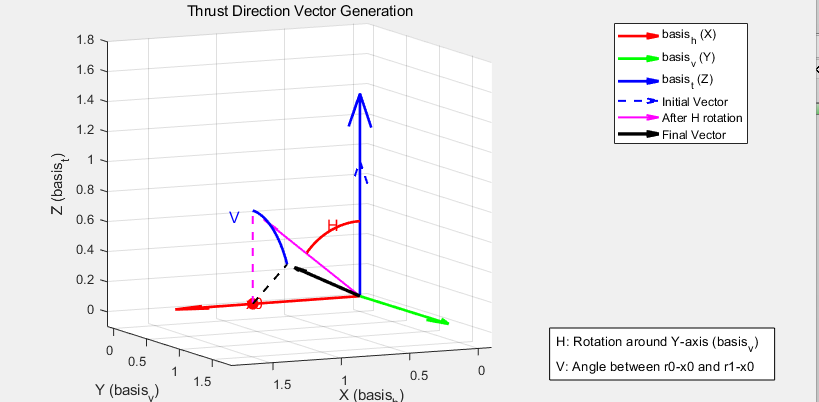

# JetPeripheral Methods

This document describes the Lua methods available in the `JetPeripheral` peripheral.

- 如图所示，X轴为矢量喷气机的水平分量，Y轴为垂直分量，Z轴为喷气机的朝向方向矢量，
为了确定水平分量，可以给Horizontal设置一个正的量，此时观察喷管往哪个方向偏移，该偏移方向的反方向即水平分量（因为是“推”力）
- 为了得到推力矢量，可以认为矢量初始方向平行Z轴，先绕Y轴旋转H角，然后矢量绕X轴旋转V角，得到最终推力的方向矢量

### `setVerticalTilt(angle)`
- **参数**：
  - `angle` (`double`): 
- **返回值**：`void` - 
- **描述**：设置V角大小rad

### `setHorizontalTilt(angle)`
- **参数**：
  - `angle` (`double`): 
- **返回值**：`void` - 
- **描述**：设置H角大小H

### `setOutputThrust(thrust)`
- **参数**：
  - `thrust` (`double`): 
- **返回值**：`void` - 
- **描述**：设置输出力的大小

